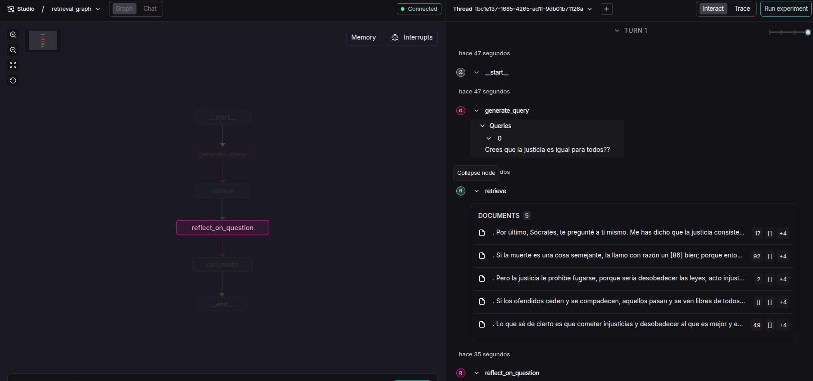

A Local, Conversational Agent

Socrates is a local-first, multilingual conversational agent that engages users using the Socratic method, grounded in Plato’s complete works, enriched with semantic retrieval, and orchestrated through LangGraph.
It can converse via text or voice, running entirely on your own machine using a local Mixtral model.

This project explores how classical philosophy, modern NLP pipelines, and graph-based AI orchestration can meet in a single system.

  

------------------------------------------------------------------------------------------------------------------------------

🧠 Philosophy Meets Pipelines — The Data Story

This project does not rely on pre-packaged datasets.

Instead, the knowledge pipeline looks like this:

1. 🕷️ Scraping

Plato’s complete works are scraped from filosofia.org using Scrapy.

2. 🧬 Linguistic Analysis

Texts are processed with spaCy for NLP analysis and normalization.

3. 📦 Structured Storage

The processed output is saved as a structured JSON file: (platon_analisis_nlp.json)

4. 🔎 Semantic Indexing

Documents are embedded using: "sentence-transformers/paraphrase-multilingual-MiniLM-L12-v2"

5. 🧠 Socratic Retrieval

Retrieved passages are never answered directly — they are used as intellectual tension for Socratic reflection.

-------------------------------------------------------------------------------------------------------------------------------

🏗️ System Architecture

## Retrieval & Reasoning Graph

  

Flow Overview:

__start__
   ↓
generate_query      → Reformulates the user input into a semantic search query
   ↓
retrieve            → Searches FAISS over Plato’s works
   ↓
reflect_on_question → Applies the Socratic method
   ↓
call_model          → Generates a reflective response (Mixtral)
   ↓
__end__

  

## Audio Graph (LangGraph Sandwich Architecture)

  

STT → Socrates (Main Graph) → TTS

This allows the agent to seamlessly accept voice input and return spoken responses, without polluting the reasoning logic.

## Combined Graph View

  

This view shows how audio processing and reasoning coexist in a single LangGraph system.

-----------------------------------------------------------------------------------------------------------------------------

🚀 Getting Started

git clone https://github.com/pablodeharo/conversational-agent.git
cd conversational-agent/agent
python -m venv .venv
source .venv/bin/activate
pip install -r requirements.txt

⚙️ Configuration
Model Configuration (config/models.yaml)

mixtral:
  backend: llamacpp
  model_path: /path/to/mixtral_spanish_ft.Q4_0.gguf (Your local path) 
  context_length: 8192
  n_gpu_layers: 35
  n_threads: 8
  temperature: 0.7
  top_p: 0.9
  max_tokens: 512

📥 Document Ingestion
python src/retrieval_graph/ingest.py \
  --file data/platon_analisis_nlp.json

  This will:

- Generate embeddings
- Build FAISS index
- Persist everything locally

▶️ Running the Agent

langgraph dev --allow-blocking

